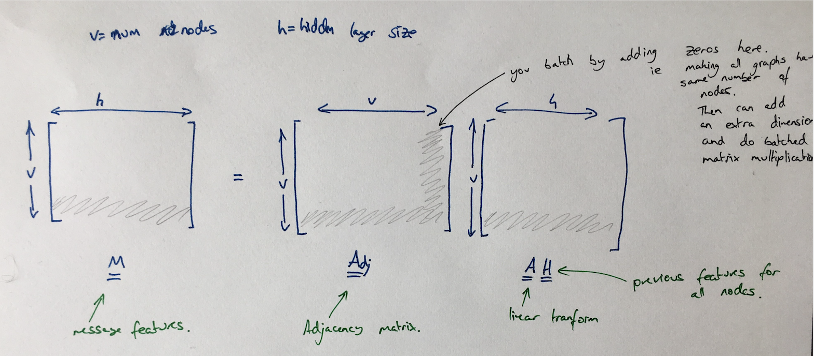
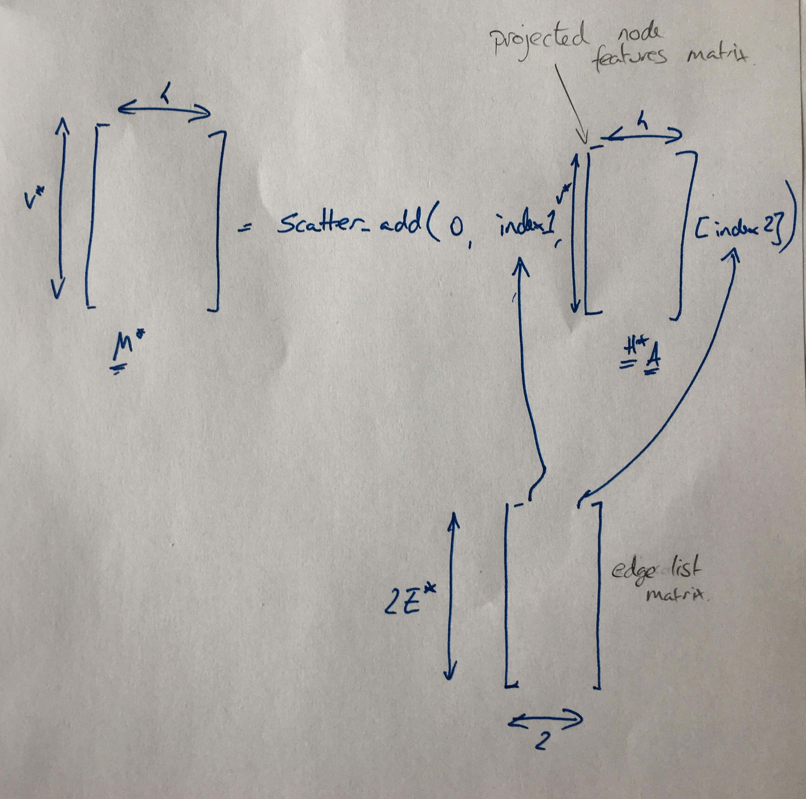
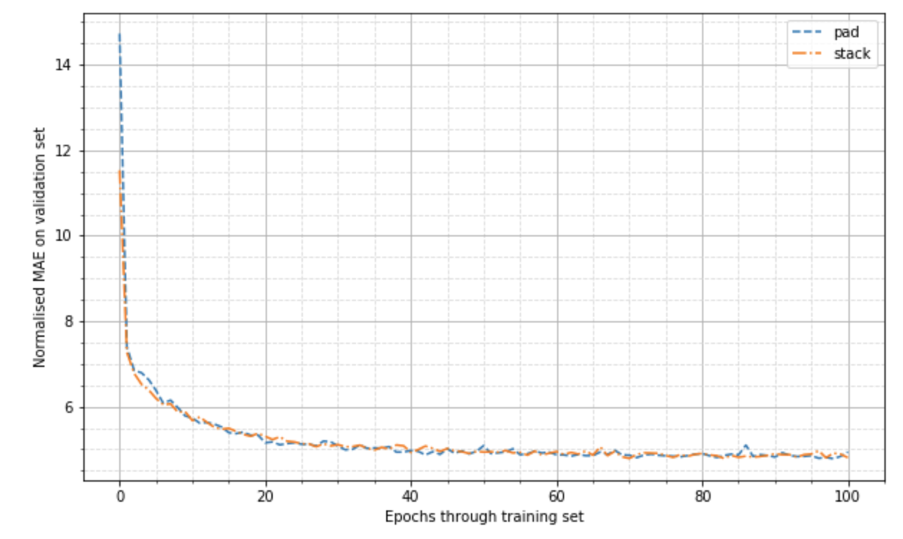

# GNN: Graph Neural Networks

Playground to explore different patterns of doing Gated Graph Neural Networks (Li et al., 2015; Gilmer et al., 2017).
So far the code in this library is mostly just an incomplete PyTorch port of some of the methods in
 https://github.com/Microsoft/gated-graph-neural-network-samples.
We are only interested in running these networks on small graphs (eg representing organic chemical molecules), for which
we expect to be able to fit multiple graphs in each minibatch.

## Notation
We will stick to using this notation whilst documenting our code.

### Core  
`b` the batch size  
`e` the number of edge types  
`v` the number of nodes for adjacency matrix in one graph
`v*` the number of stacked active nodes in all the graphs  
`E*` the number of edges in all the graphs
`h` the dimension of the node representation    
`[...]` corresponding array/tensor shape. eg `[2,4]` signifies a 2 by 4 matrix

### Stack pattern
`g` the number of groups

## Patterns

We have various ways of representing graphs, eg adjacency matrices, adjacency lists etc.
When operating on the GPU we have the challenged that we will be operating
Here we go through the various patterns for implementing GGNs. 

### Pad Pattern

Standard implementation as seen elsewhere, eg https://github.com/Microsoft/gated-graph-neural-network-samples.  
Takes in adjacency matrices and node features. Achieves parallelism via padding the these with zeros such that all the
graphs have the same number of nodes.

### Sparse Pattern
Think this matches the sparse pattern eg at https://github.com/Microsoft/gated-graph-neural-network-samples.  

Nodes features are stacked up together to form one matrix.
The edges are represented by a stacked adjacency list structure.

### Node Stack Pattern

Similar to the sparse pattern above except we deal with the neighbours in a different manner.
(so maybe that pattern is worth using instead, this pattern just exists as coded up first)
We no longer fully unroll the adjacency list but instead pad it.

The node stack pattern  stacks all the nodes associated with all the graphs together in one large data structure.
We can associate groups with each node in this list, which allows us to associate individual nodes together to from a
group to eg represent a graph. Also associated with a group we can have neighbour relations which index 
neighbours relative to the group that the nodes exist in.
Here we take advantage of the fact that molecules have low maximum degrees to ensure that the compute does not get too 
unwieldy.

## Examples 

### QM9 Dataset

Here we replicate the setup of regressing for mu in QM9 dataset (the task in Gilmer et al.).
The setup and dataset is taken from https://github.com/Microsoft/gated-graph-neural-network-samples.
Note we do not expect to replicate the results of Gilmer et al as we do not match hyperparameters or even use the same 
underlying features.

Times of the different methods (for one forward pass through the validation dataset. Run on one machine with K80 GPU).
Note that we can possibly speed this up further, eg for the stack method in particular much of the initial pre-compute/
pre-processing of the graphs could be done ahead of time if we increased the number of parallel workers further.

| Variant       | Time (s)      |
| ------------- | ------------- |
| Stack         | 12.51         |
| Pad           | 5.49          |
| Sparse        | 7.01          |

(although sparse seems faster at training -- so batch size may be important here)
Also the data loading and forward run seems fairly different for the different methods.

## TODOs
* consider using `TORCH.SPARSE` as an alternative way to do a padded pattern 
* consider doing padded pattern but make adjacency matrix hold all graphs -- probably only makes sense when switch to
sparse methods.
* dropout
* weighted attention
* global node (see Gilmer et al.)
* edge biases

## Refs

  Li, Y., Tarlow, D., Brockschmidt, M. and Zemel, R., 2015. Gated graph sequence neural networks.
  arXiv preprint arXiv:1511.05493.  

  Gilmer, J., Schoenholz, S.S., Riley, P.F., Vinyals, O. and Dahl, G.E., 2017.
  Neural message passing for quantum chemistry. arXiv preprint arXiv:1704.01212.
